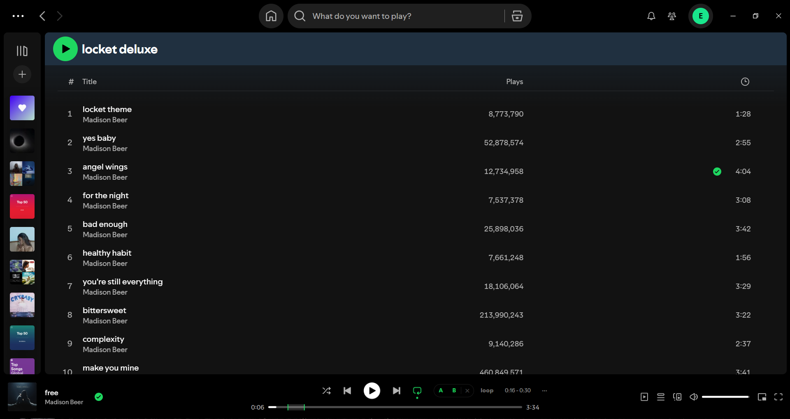
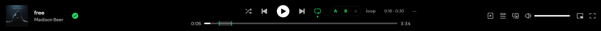
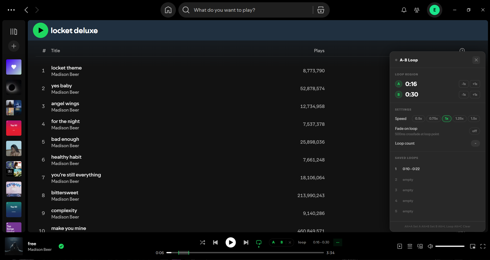
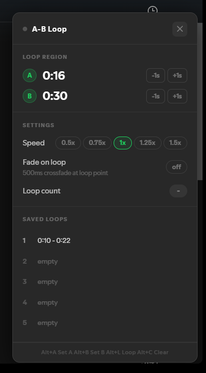

<div align="center">

# Spotify A-B Loop

**Precision loop any section of a Spotify track between two points.**  
Built directly into the desktop client — no Spicetify, no frameworks, no BS.




</div>

---

## What it does

Sets a start point **A** and an end point **B** on any track. When playback reaches B, it instantly seeks back to A — looping that section indefinitely. Works while Spotify is in the background, minimized, or when you're on another app.




The loop triggers with **sub-16ms precision** — not by polling a 1-second position tick like naive implementations. Position is tracked using a real-time clock anchored to Spotify's internal state, then extrapolated using `performance.now()` between syncs. When Spotify reports a new position, the clock only resyncs if the drift exceeds 1.5 seconds (indicating a genuine seek), keeping the interpolation smooth and the loop point razor-sharp.

---

## Features

- **A-B loop** with precise timing — triggers within ~16ms of point B
- **Per-track persistence** — loop points and saved slots restore automatically when you return to a track
- **5 saved loop slots** per track — save, load, and delete named loop regions
- **Fine-tune nudge** — adjust A or B by ±1 second after setting
- **Speed control** — 0.5× / 0.75× / 1× / 1.25× / 1.5× playback rate
- **Fade on loop** — 500ms crossfade when jumping back to A
- **Loop counter** — tracks how many times the loop has fired
- **Background-safe** — uses `requestAnimationFrame` when focused, falls back to a dedicated interval when the window is hidden, with an extended 1500ms lookahead to compensate for browser timer throttling
- **Keyboard shortcuts** — set points and toggle loop without touching the mouse
- **Progress bar overlay** — visual A-B region highlighted on the seek bar
- **Seek detection** — if you scrub outside the A-B range while looping, the loop automatically pauses




---

## Keyboard shortcuts

| Shortcut | Action |
|----------|--------|
| `Alt + A` | Set loop start (A) at current position |
| `Alt + B` | Set loop end (B) at current position |
| `Alt + L` | Toggle loop on / off |
| `Alt + C` | Clear A and B points |
| `Alt + P` | Open / close the settings panel |

---

## Requirements

- Spotify for Windows, downloaded from [spotify.com](https://spotify.com/download)
- **Not** the Microsoft Store version
- Windows 10 or 11
- PowerShell 5.1+ (built into Windows)

---

## Installation

### 1. Download

Put `install.ps1` and `ab-loop.js` in the same folder.

### 2. Unblock the script

Windows marks downloaded scripts as untrusted. Open PowerShell in that folder and run:

```powershell
Unblock-File .\install.ps1
```

### 3. Allow local scripts (one-time)

```powershell
Set-ExecutionPolicy -Scope CurrentUser RemoteSigned
```

Press `Y`.

### 4. Run

```powershell
.\install.ps1
```

The installer stops Spotify, backs up `xpui.spa`, injects `ab-loop.js`, and patches `index.html`. Takes about two seconds.

### 5. Launch Spotify

The **A B × loop ···** controls appear in the player bar within a few seconds of the player loading.

---

## Usage

### Basic loop

1. Play a track and reach your desired start point
2. Click **A** — it turns green
3. Play forward to your desired end point
4. Click **B** — it turns green
5. Click **loop** — turns green, loop activates

The label between the buttons shows your range: `2:14 – 2:24`

### Settings panel

Click **···** to open the floating panel on the right side of the screen.



**Loop Region** — your A and B timestamps with large readable time values. Use `-1s` / `+1s` to nudge either point with precision after setting.

**Settings** — cycle playback speed, toggle the 500ms fade crossfade on loop, and see the live loop counter.

**Saved Loops** — save up to 5 loop regions per track. Points are stored in `localStorage` keyed by track title and artist, so they persist across sessions and restore automatically.

### Saved loops

- Click a slot row to **load** it
- Hover a row and click **save** to save current A/B to that slot
- Hover a row and click **del** to delete it
- Active slot shown in green with an `active` badge

---

## After a Spotify update

Updates overwrite `xpui.spa`. Re-run `install.ps1` to re-apply the patch.

---

## Uninstall

```powershell
.\uninstall.ps1
```

Restores the original `xpui.spa` from the backup. Or manually rename `%AppData%\Spotify\Apps\xpui.spa.bak` → `xpui.spa`.

---

## Enabling DevTools (optional)

Useful for debugging. Close Spotify, then run:

```powershell
$f = "$env:LOCALAPPDATA\Spotify\offline.bnk"
$enc = [System.Text.Encoding]::GetEncoding(1251)
$c = [System.IO.File]::ReadAllText($f, $enc)
$c = $c.Replace('<app-developer>0</app-developer>', '<app-developer>2</app-developer>')
$c = $c -replace '(app-developer..)(2|1|0)', '${1}2'
[System.IO.File]::WriteAllText($f, $c, $enc)
```

Launch Spotify → `Ctrl+Shift+I`.

> Spotify resets this on each launch. Re-run when needed.

---

## How it works

### Patching

Spotify's desktop client is Electron. Its entire frontend — React, webpack bundles, everything — lives inside a ZIP at `%AppData%\Spotify\Apps\xpui.spa`. The installer:

1. Opens `xpui.spa` as a ZIP using .NET's `System.IO.Compression`
2. Adds `ab-loop.js` as a new entry
3. Patches `index.html` inside the ZIP to load it via `<script defer>`

No binary patching. No registry edits. No network calls.

### Loop precision

Most A-B loop implementations poll `currentTime` on an interval and trigger when `pos >= B`. The problem: Spotify's internal position counter only updates every **~1000ms**. A naive implementation either fires up to 1 second early (large lookahead) or misses B entirely (small lookahead).

This implementation uses a **real-time interpolated clock**:

```
1. Spotify gives us a position update (every ~1s)
2. We record: anchorPos = raw, anchorT = performance.now()
3. Between updates: estimatedPos = anchorPos + (performance.now() - anchorT)
4. On normal 1s ticks, we don't reset anchorT — only correct anchorPos
5. This gives smooth sub-ms position tracking at rAF speed (~16ms)
```

When position reaches `B - 150ms` (foreground) or `B - 1500ms` (background), `seekTo` fires. Spotify's seek takes ~100-150ms to land, so the loop point is hit with ~0ms audible error in practice.

### Seek detection

The clock monitors for drift between predicted and actual position. A diff > 1500ms means the user seeked manually. On a detected seek:
- Clock hard-resets to the new position
- If the new position is outside A-B and loop is active, loop pauses automatically

### Background safety

When Spotify is not the focused window, Chrome/Electron throttles `requestAnimationFrame` to ~1fps or stops it entirely. The implementation runs a parallel `setInterval` at 500ms that activates when `document.hidden` is true, with a wider lookahead to compensate for the coarser timing.

---

## Compatibility

| Version | Status |
|---------|--------|
| 1.2.83.x | ✅ Tested |
| 1.2.6x – 1.2.8x | ✅ Should work |
| Microsoft Store | ❌ Not supported |

---

## Troubleshooting

**Buttons don't appear after launch** — wait 5–10 seconds, or play a track first.

**Loop fires slightly early/late** — this is the 150ms pre-seek lookahead. It's intentional: Spotify's seek takes ~100–150ms to land, so triggering early means the audio hits point B precisely. If your setup has different latency, the value is a single constant in `ab-loop.js` — search for `150`.

**Saved loops not restoring** — check that the track title and artist are the same (the storage key is `title__artist`). Compilations or tracks with featuring artists may have slightly different metadata between plays.

**Spotify updated, patch is gone** — re-run `install.ps1`.

---

## Disclaimer

Not affiliated with Spotify. Modifying the client may violate Spotify's [Terms of Service](https://www.spotify.com/legal/end-user-agreement/). Use at your own risk.

This tool makes no network requests, bypasses no DRM, removes no ads, and unlocks no premium features. It adds a single local JavaScript file that runs client-side only.